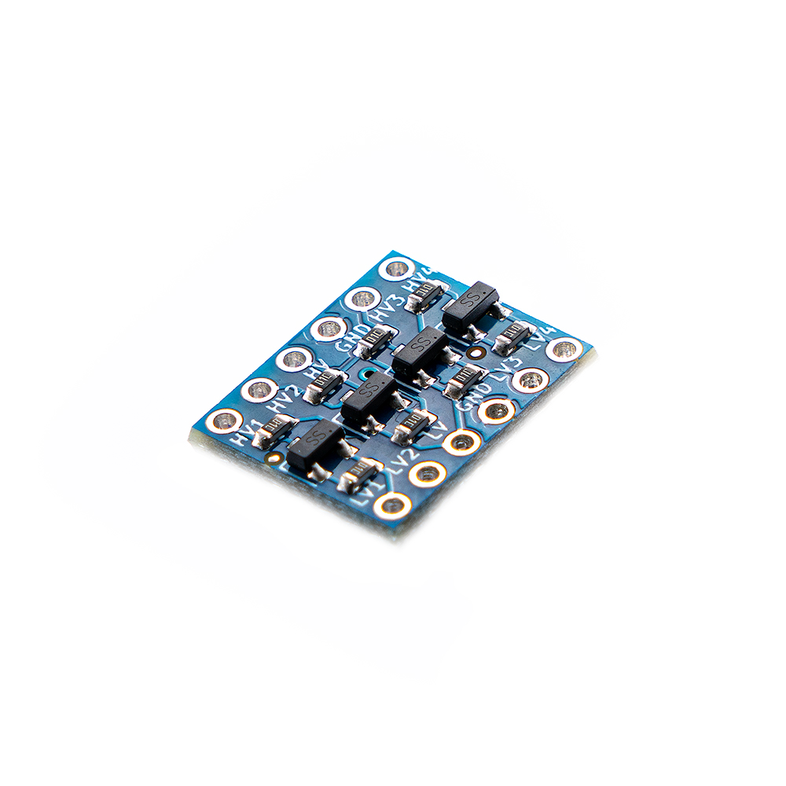

# Core Electronics Logic Level Converter Bidirectional, 4 Channel

This [Bi-Directional Logic Level Converter](https://core-electronics.com.au/catalog/product/view/sku/CE07510) is a breadboard-friendly device that converts between eg. 5V and 3.3V logic. The four channels are independent and work in both directions, making this converter appropriate for shifting I2C bus voltages.

Power the board from the two voltage sources you're using. Connect the higher voltage (eg. 5V) to the 'HV' power pin, the lower voltage (eg. 3.3V) to the 'LV' power pin, and the ground to the 'GND' pin.

Features:

- 4 independent channels
- Breadboard friendly - just bring your own [pin headers](https://core-electronics.com.au/catalog/product/view/sku/FIT0084)
- Small size (15x13mm)
- Manufactured and [supported](https://core-electronics.com.au/contacts/) in Australia by Core Electronics

# License
This project is open source - please review the LICENSE.md file for further licensing information.

If you have any technical questions, or concerns about licensing, please contact technical support on the [Core Electronics forums](https://forum.core-electronics.com.au/).

# Attribution
The hardware design of this module is influenced by the design from [Sparkfun](https://github.com/sparkfun/Logic_Level_Bidirectional).
